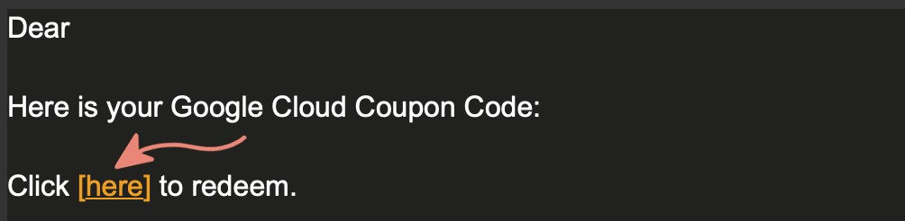
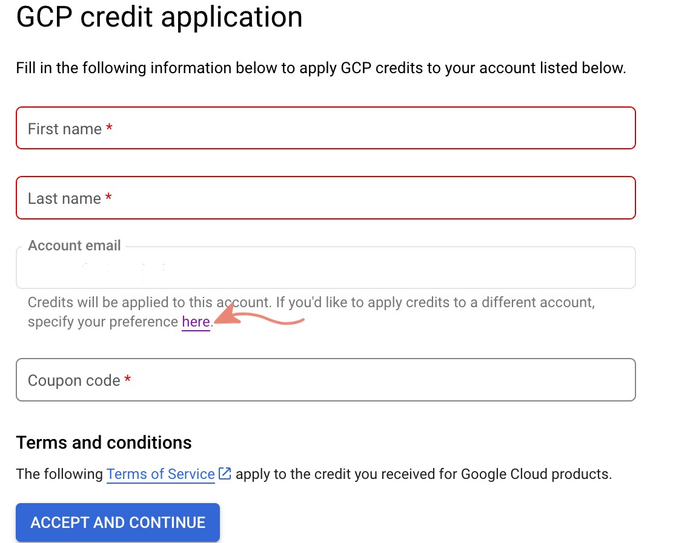
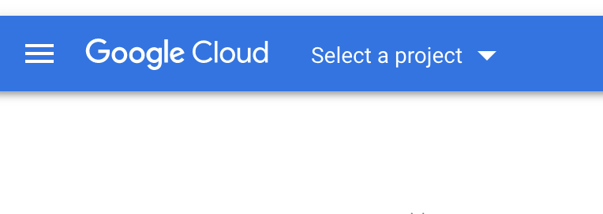
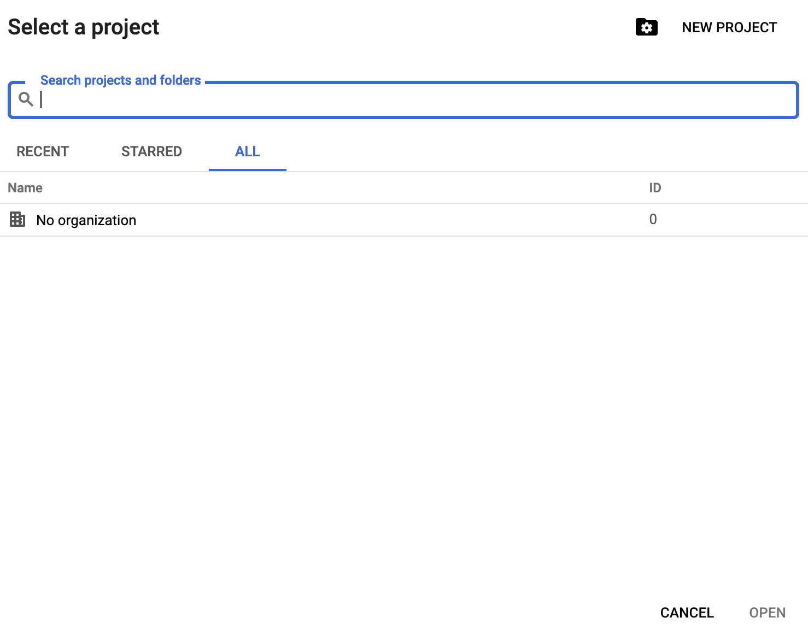
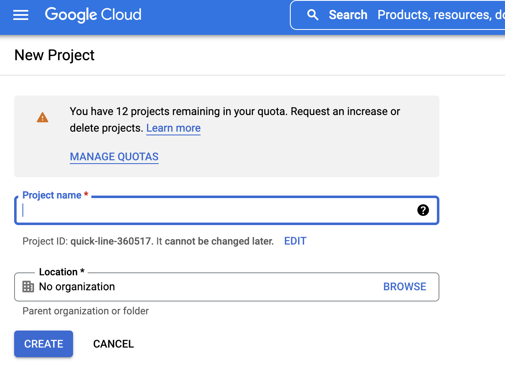
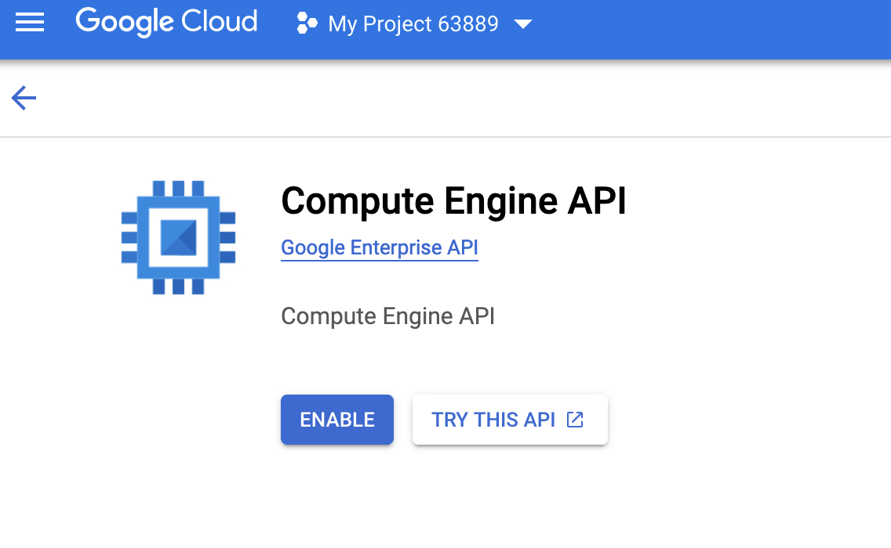
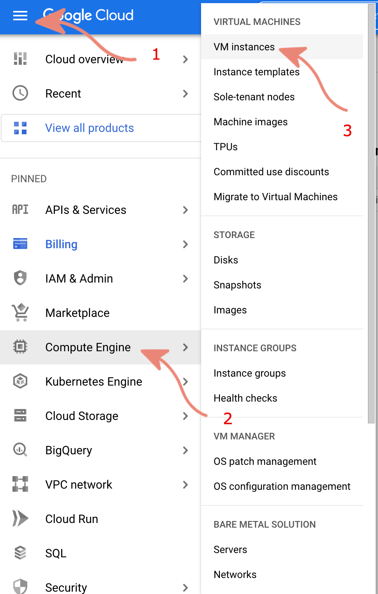
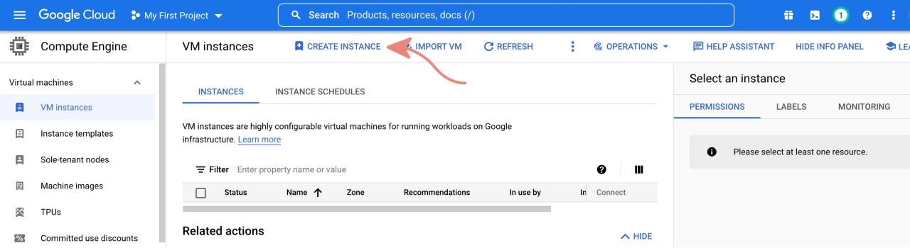
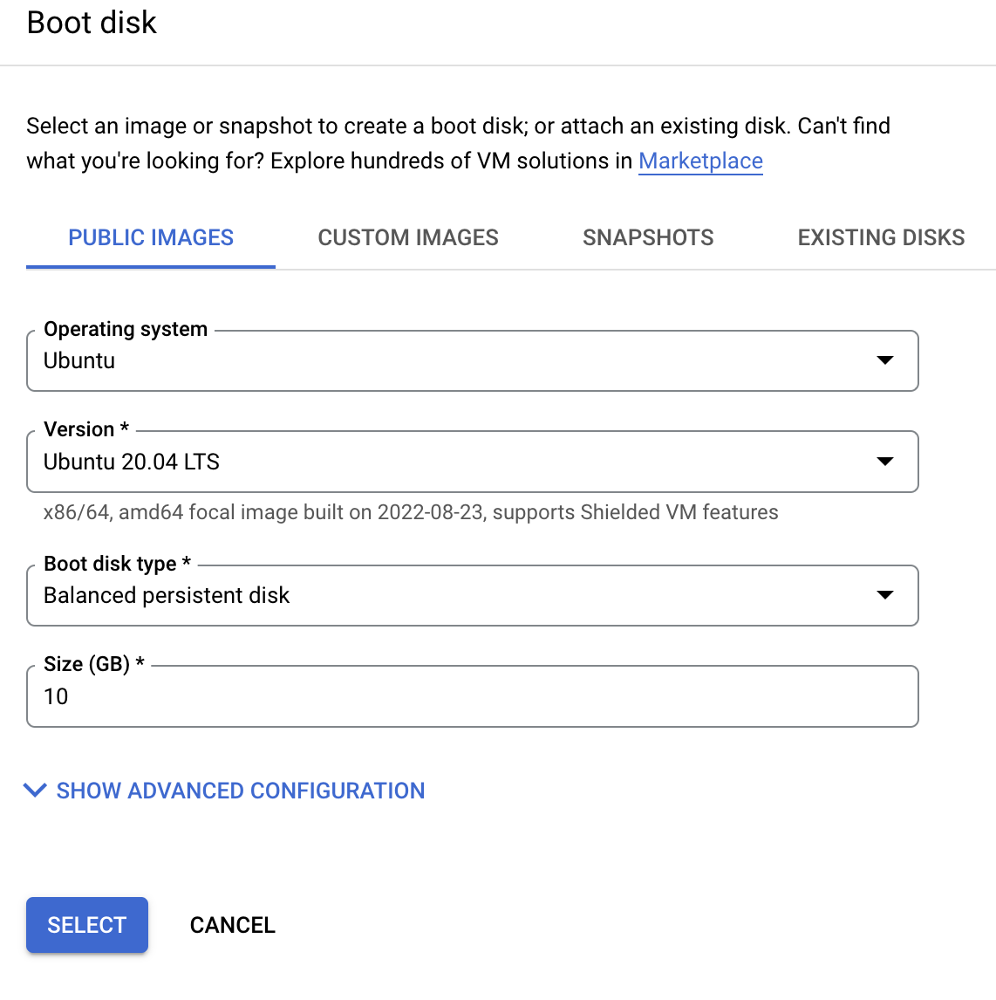
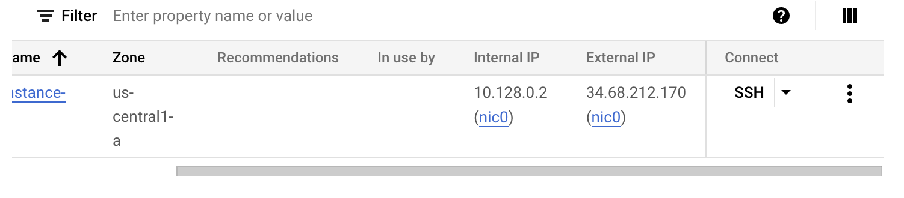

# Setup for GCP Users

### Setup GCP
**Please use your own gmail account (DO NOT USE YOUR GW EMAIL)**

1. After you get the GCP coupon email, click link to redeem.



2. The link will bring you to the webpage where you can apply the coupon to your Gmail account. Make sure you are using your own Gmail instead of your gw email account.



3. Go to your GCP console. Click **Select a project** -> **NEW PROJECT**. Give your project a name and click **CREATE**.







4. Click the navigation menu located in the left top corner. Then go to **Compute Engine**. Then enable **Compute Engine API**. 




5. Go to your GCP console. Click the navigation menu located in left top corner. Then go to **Compute Engine** -> **VM instances**. You can start to create the VM for this course by clicking **CREATE INSTANCE**.





6. You can keep everything by default except the OS version. We are going to use Ubuntu 20.04 LTS for this course. Scroll down to the **Boot disk** section and change the OS. After that, just click **CREATE** and it will create the VM for you.



7. Once you see your VM booted up, you can access it by clicking **SSH** next to it. It will bring up a web console of your VM. You also can access to VM by running `ssh USERNAME@YOUR_VM_EXTERNAL_IP` in your terminal. Then you can start to set up your xv6 environment.



**Please STOP YOUR VM after you use it. The service is using pay-as-you-go model.**

### Setup xv6
 
Open a shell in your VM (e.g. using ssh or in VSCode if it is not already open and hit ctrl+\` to open the integrated shell). It should show `USERNAME@HOSTNAME:~$`. We're now ready to install xv6 and its dependencies.

    ```sh
    sudo apt-get update --yes
    sudo apt-get install build-essential gdb glibc-doc qemu-system-x86 --yes
    cd ~
    mkdir projects
    cd projects
    git clone https://github.com/gwu-cs-os/gwu-xv6
    cd gwu-xv6
    code -r .
    ```

11. This will open the xv6 project. Feel free to look at the source code. Reopen the terminal and build xv6.

    ```sh
    make qemu-nox
    ```

12. Assuming everything completed properly, you should boot into xv6, an operating system modeled after version 6 of Bell Labs Research Unix.
13. In xv6, run `cat README`
14. Exit xv6 by hitting ctrl+a (then releasing both keys) and then x.
